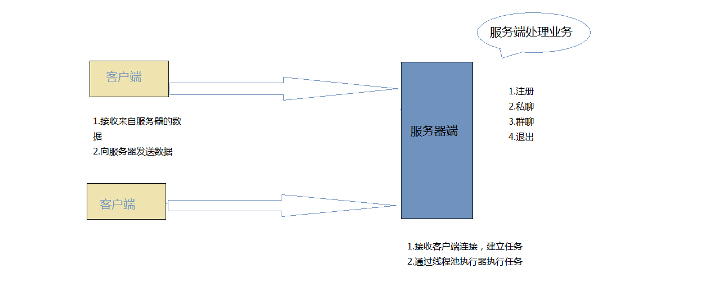

## 项目名称
趣味聊天室

## 项目描述
支持群聊，私聊的网络聊天室

## 使用技术
+ JavaSE基础
+ Socket编程
+ 多线程
+ MySQL
+ JDBC

## 项目功能
+ 注册
+ 私聊
+ 群聊
+ 退出

## 项目实现

+ 服务端：采用线程池调度执行服务器与客户端业务处理逻辑

+ 客户端：采用读写线程，分别处理交互与服务器数据接收

## 测试结果
+ 平均响应时间：100ms

+ 支持同时在线用户：1000-1500

## 项目总结
+ 熟悉项目的开发流程（需求，分析，技术选择，设计，编码，测试，
打包，发布）
+ 掌握了Java的网络编程的常用API和步骤

+ 进一步认识了多线程的优点，能熟练掌握和使用多线程

+ 熟悉了maven工具的使用

## 优化与扩展
### 优化
   + 参数严格校验
   + 异常信息处理
   + 用户体验（信息展示）
   
### 扩展
   + 数据存储到存储引擎（MySQL）
   + 注册信息存储
   + 增加登录功能（用户名+密码（用户名不能重复））
   + 历史消息存储   

